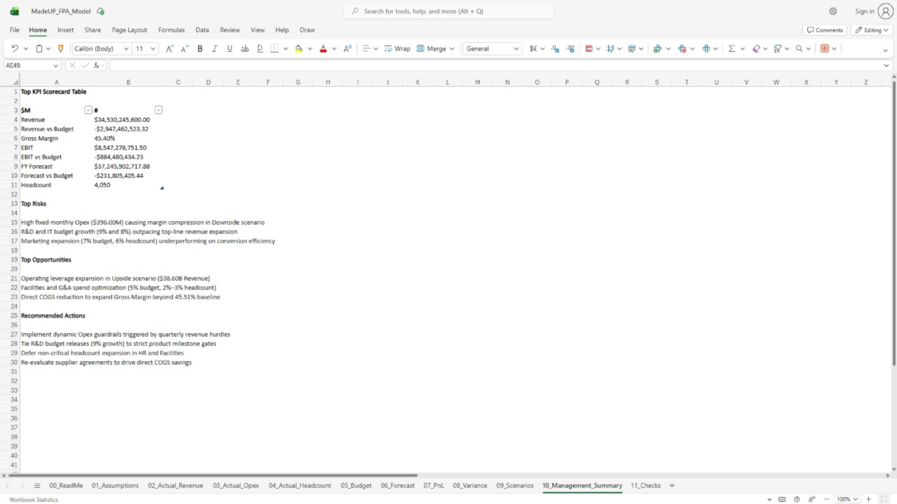
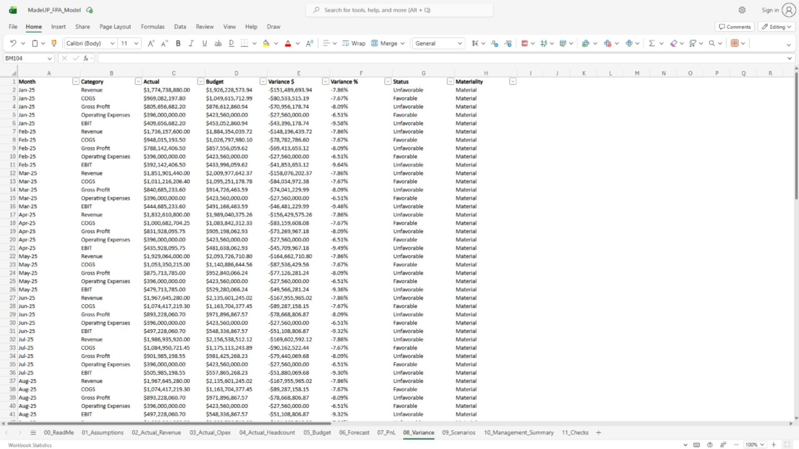
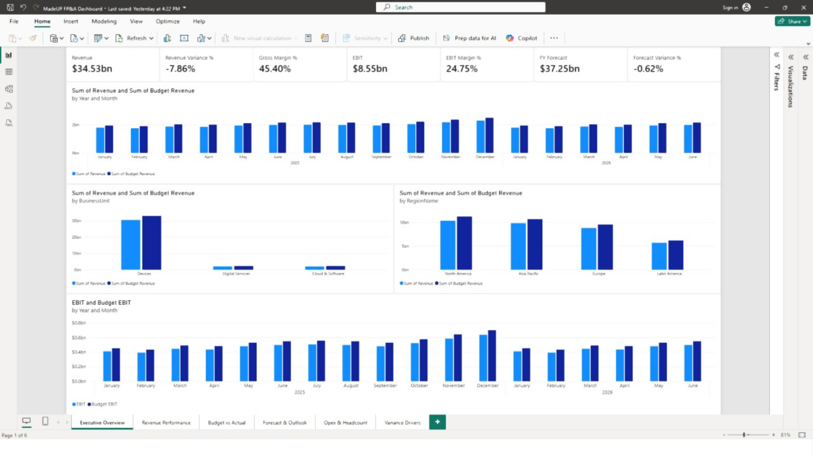
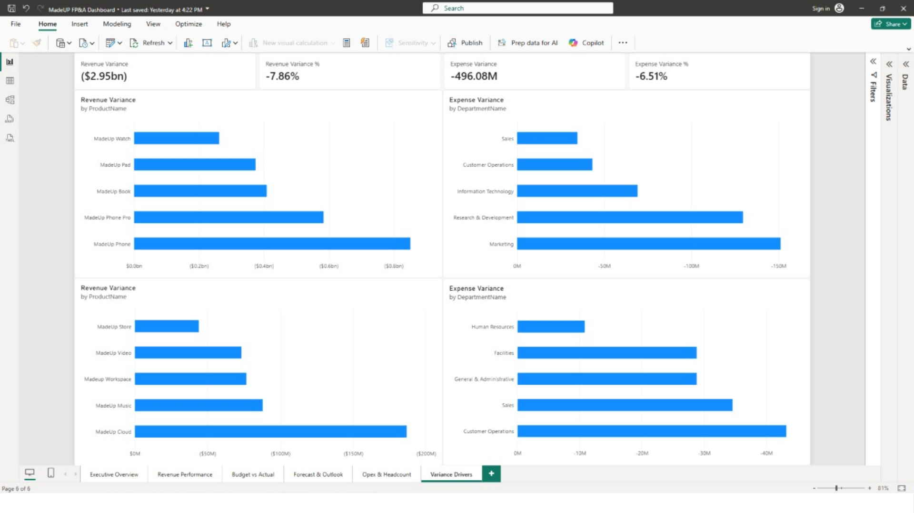
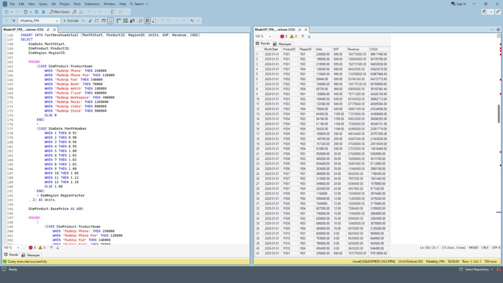

# MadeUP — Integrated FP&A Analytics Project

MadeUP is a synthetic technology company created for an end-to-end Financial Planning & Analysis case study.

The project demonstrates how SQL, Microsoft Excel, and Power BI can work together to support financial data analysis, budgeting, forecasting, variance analysis, scenario planning, and management reporting.

The dataset is synthetic and does not represent the financial results of a real company.

## Business Problem

Management needs a repeatable way to understand whether the company is meeting budget, identify the drivers of financial variance, update the full-year outlook, and communicate financial performance to decision-makers.

## Objectives
* Establish a robust relational star schema for financial data warehousing.
* Build a driver-based 2026 operating budget and rolling forecast model in Excel.
* Implement rigorous model controls and automated error checks (`MODEL PASS`).
* Simulate financial elasticity across Downside, Base, and Upside scenarios.
* Deliver interactive executive dashboards in Power BI.

## Tools

| Tool | Role |
| :--- | :--- |
| **SQL** | Financial data storage, querying, validation and analysis |
| **Excel** | Budgeting, forecasting, financial modeling and variance analysis |
| **Power BI** | Management reporting, KPI visualization and financial storytelling |

## Architecture

```text
Synthetic Financial Data
↓
SQL Database
↓
SQL Analysis / Exports
↓
Excel FP&A Model
↓
Budget / Actual / Forecast / Variance
↓
Power BI
↓
Management Dashboard
↓
Insights & Recommendations
```

## Business Model
* **Company**: MadeUP
* **Industry**: Technology
* **Business Units**: 
  * *Devices* (Hardware products driven by Unit Sales $	imes$ Average Selling Price)
  * *Cloud & Software* (Subscription-based platforms driven by Active Subscribers $	imes$ ARPU)
  * *Digital Services* (Consumer media and transactional services)
* **Regions**: North America, Europe, Asia Pacific, Latin America.
* **Departments**: Sales, Marketing, R&D, G&A, IT, Customer Operations, HR, Facilities.

## FP&A Workflow
1. **Define Requirements & KPIs**: Establishing core business definitions and financial metrics.
2. **Data Engineering**: Structuring relational dimensional and fact tables.
3. **Budgeting**: Developing driver-based 2026 plans from 2025 actual baselines.
4. **Forecasting**: Blending H1 actual performance with H2 run-rates.
5. **Scenario Analysis**: Evaluating Downside, Base, and Upside financial elasticity.
6. **Executive Reporting**: Visualizing scorecard metrics and variance drivers in Power BI.

## SQL Component
* **Schema Design**: Star schema separating dimensions (`DimProduct`, `DimRegion`, `DimDepartment`, `DimExpenseCategory`) from fact tables (`FactRevenueActual`, `FactOpexActual`, `FactHeadcountActual`).
* **Data Integration**: Standardized queries to feed historical actuals into downstream financial models.

## Excel Component
* **Model Engine**: `MadeUP_FPA_Model.xlsx` featuring structured sheets for assumptions, actuals, budget, forecast, P&L statements, variance analysis, scenarios, and management scorecards.
* **Integrity Checks**: Automated verification sheet (`11_Checks`) guaranteeing zero mathematical discrepancies (`MODEL PASS`).

## Power BI Component
* **Dashboard Structure**: Six dedicated pages covering Executive Overview, Revenue Performance, Budget vs. Actual, Forecast & Outlook, Opex & Headcount, and Variance Drivers.
* **Interactive Filtering**: Dynamic cross-slicing by business unit, region, and department.

## Key Financial Questions
1. Are we meeting budget? *(Unfavorable top-line variance of $-\$2.95	ext{B}$)*
2. Which products are driving revenue? *(Devices and Cloud segments lead volume expansion)*
3. Which regions are underperforming? *(Latin America and Europe show regional headwinds)*
4. Where are expenses exceeding budget? *(Support functions and R&D/IT budget growth outpacing top-line)*
5. What is the latest full-year forecast? *($\$37.25	ext{B}$ full-year outlook)*
6. What are the largest financial risks? *(Rigid fixed monthly Opex of $\sim \$396.00	ext{M}$)*
7. What are the largest opportunities? *(Operating leverage scaling in Upside scenarios)*
8. What actions should management consider? *(Dynamic Opex guardrails and milestone-gated R&D spending)*

## Key Insights
* **Revenue Performance**: Full-year revenue tracking at $\$34.53	ext{B}$ against budget, reflecting market headwinds.
* **Gross Margin Resilience**: Maintained a healthy gross margin of $45.40\%$ across hardware and software mixes.
* **Operating Profitability**: Operating income (EBIT) reaches $\$8.55	ext{B}$ after absorbing departmental Opex.
* **Headcount Scale**: Active workforce stands at $4,050$ employees across 8 functional departments.

## Project Structure
```text
MadeUP-FPA-Project/
│
├── README.md
│
├── 01_Business_Requirements/
│   ├── Business_Model.md
│   ├── KPI_Definitions.md
│   └── FP&A_Assumptions.md
│
├── 02_Data/
│   ├── Raw/
│   ├── SQL_Exports/
│   └── PowerBI_Exports/
│
├── 03_SQL/
│   ├── MadeUP_FPA_Query.sql
│   ├── 01_Create_Database.sql
│   ├── 02_Create_Tables.sql
│   ├── 03_Load_Data.sql
│   ├── 04_Analysis.sql
│   └── 05_Validation.sql
│
├── 04_Excel/
│   └── MadeUP_FPA_Model.xlsx
│
├── 05_PowerBI/
│   └── MadeUP_FPA_Dashboard.pbix
│
├── 06_Documentation/
│   ├── Data_Dictionary.md
│   ├── Methodology.md
│   ├── Reconciliation.md
│   ├── Management_Commentary.md
│   └── Limitations.md
│
├── 07_Screenshots/
│   ├── excel_fpna_model.png
│   ├── excel_variance_analysis.png
│   ├── powerbi_executive_dashboard.png
│   ├── powerbi_variance_drivers.png
│   └── sql_revenue_analysis.png
│
└── 08_Project_Log/
    └── PROJECT_PROGRESS.md
```

## Methodology
* **Synthetic Data**: Simulated enterprise dataset representing global technology operations.
* **Historical Baseline**: Full-year 2025 actual performance.
* **Planning Horizon**: 2026 calendar year.
* **Forecast Methodology**: YTD actuals (Jan–Jun) combined with run-rate projections (Jul–Dec).
* **Scenario Sensitivity**: $\pm 3\%$ growth adjustments for Downside and Upside evaluations.

## Data Disclaimer
> This project uses synthetic data and is intended for educational and portfolio purposes.
> 
> The financial results do not represent a real company.
> 
> Budget and forecast assumptions are analyst-developed.

## Screenshots

### Excel Financial Model


### Excel Variance Analysis


### Power BI Executive Dashboard


### Power BI Variance Analysis


### SQL Query & Results


## Skills Demonstrated
* **Financial Planning & Analysis (FP&A)**: Budgeting, rolling forecasting, variance analysis, and scenario modeling.
* **Data Modeling & SQL**: Relational star schema design and data structuring.
* **Advanced Excel**: Complex formulas (`XLOOKUP`, `SUMIFS`), financial statement modeling, and automated error checks.
* **Data Visualization & BI**: Executive dashboard design and storytelling in Power BI.
